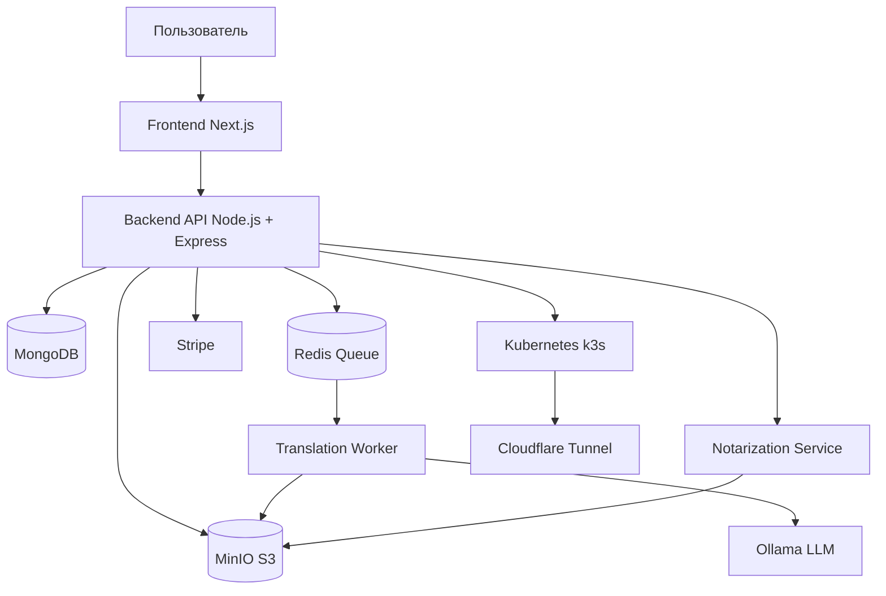

# Translation and Notarization Service

Облачная платформа для перевода документов с нотаризацией.
DevOps Bootcamp 2026.

---

## Что это

Пользователь загружает документ, оплачивает перевод через Stripe,
AI (Ollama) переводит его, нотариус подписывает - и пользователь
скачивает готовый нотаризованный документ.

---

## Архитектура



---

## Команда

| Участник | GitHub | Роль |
|----------|--------|------|
| Marta | @marta77784 | Infra / DevOps |
| Alex | @alex-builds | Backend API |
| Юля | @yuliasteele | Frontend |
| Олеся | @olessya2907 | Payments + Notarization |
| Вадим | @vadimvovnenko | Translation Workers |
| Нурай | @nurayalybaeva-tech | Kubernetes |
| Алекс | @Alexwp01 | Docs & Demo |

---

## Стек

| Слой | Технологии |
|------|-----------|
| Frontend | Next.js 14, Tailwind CSS |
| Backend | Node.js, Express, MongoDB, JWT |
| Хранилище | MinIO (S3-compatible) |
| Очередь | Redis, BullMQ |
| AI перевод | Ollama (llama3.2:1b / qwen2.5:0.5b) |
| Оплата | Stripe Checkout |
| Email | Resend / nodemailer |
| Инфра | Docker, k3s, Ingress, Cloudflare Tunnel |
| Тесты | Playwright |

---

## Запуск локально

Требования: Docker + Docker Compose, Node.js 18+, Git

```bash
git clone https://github.com/marta77784/translation-notarization-service.git
cd translation-notarization-service
cp .env.example .env
docker-compose up -d
open http://localhost:3000
```

Тестовая карта Stripe: 4242 4242 4242 4242

---

## Деплой в Kubernetes

```bash
curl -sfL https://get.k3s.io | sh -
kubectl apply -f k8s/
kubectl get pods -w
```

---

## Структура проекта
translation-notarization-service/
├── frontend/
├── backend/
├── workers/
├── notarization/
├── k8s/
└── docs/
└── MVP.md

---

## Тесты

```bash
npx playwright test
```

---

## Документация

- [MVP-границы](docs/MVP.md)

---

## Лицензия

MIT 2026 - Translation and Notarization Service Team

## 👥 Команда и роли

| Участник | GitHub | Направление | Задачи |
|----------|--------|-------------|--------|
| Marta Dzekevich | [@marta77784](https://github.com/marta77784) | ☸️ Infra/DevOps | #1 #3 #18 #19 #20 |
| Alex | [@alex-builds](https://github.com/alex-builds) | 🗄️ Backend API | #5 #6 #7 #8 #9 |
| Yulia | [@yuliasteele](https://github.com/yuliasteele) | 🎨 Frontend | #10 #11 #12 #13 #29 |
| Olesya | [@olessya2907](https://github.com/olessya2907) | 💳 Payments | #14 #16 #22 #30 #31 |
| Vadim | [@vadim](https://github.com/vadim) | ⚙️ Workers | #15 #24 #25 #26 #27 |
| Нурайым | [@nurayalybaeva-tech](https://github.com/nurayalybaeva-tech) | 🔧 Kubernetes + Тесты | #21 #23 #28 #32 #33 |
